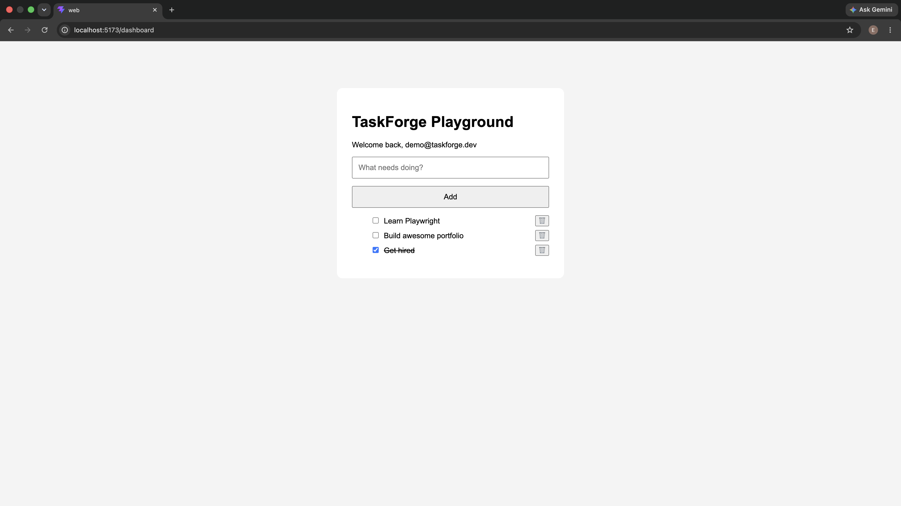

# TaskForge Playground

A modern React + TypeScript playground for building production-quality frontend applications.

Current version: **1.0.1**

The project started as a simple Todo application and is gradually evolving into a portfolio project demonstrating professional React architecture, reusable UI components, testing, accessibility, and modern frontend best practices.

---

## Tech Stack

- React 19
- TypeScript
- Vite
- React Router
- Playwright
- Lucide React
- Component-based CSS
- pnpm

---

## Features

### Authentication

- Mock login flow
- Protected routes
- Logout functionality

### Todo Management

- Create todos
- Edit todos
- Delete todos with confirmation dialog
- Toggle completed status
- Local persistence using Local Storage

### Productivity

- Case-insensitive todo search
- Filter by:
  - All
  - Active
  - Completed
- Sort by:
  - Newest or oldest
  - A–Z or Z–A
  - Completed first

### User Experience

- Toast notifications
- Responsive dashboard layout
- Reusable Button and Input components
- Icon-based actions
- Keyboard shortcuts while editing
- Auto-focus during editing

### Testing

- Playwright end-to-end tests for authentication and todo workflows
- Cross-browser coverage in Chromium, Firefox, and WebKit
- Page objects and stable `data-testid` selectors

---

## Project Structure

```
apps/
  web/
    src/
      components/
      context/
      hooks/
      pages/
      services/
      styles/
      types/

tests/
docs/
```

---

## Getting Started

Install dependencies

```bash
pnpm install
```

Run the development server

```bash
pnpm dev
```

Run all Playwright tests

```bash
pnpm test:e2e
```

Other Playwright modes

```bash
pnpm test:e2e:ui
pnpm test:e2e:headed
pnpm test:e2e:debug
```

---

## Roadmap

Upcoming improvements include:

- GitHub Actions CI
- Deployment
- Backend API integration
- Dark mode
- Expanded accessibility coverage

---

## Screenshots

### Dashboard



---

## Learning Goals

This project focuses on learning and demonstrating:

- Modern React architecture
- TypeScript
- Reusable components
- State management
- UI/UX principles
- Testing with Playwright
- Git workflows
- Clean code and maintainability
